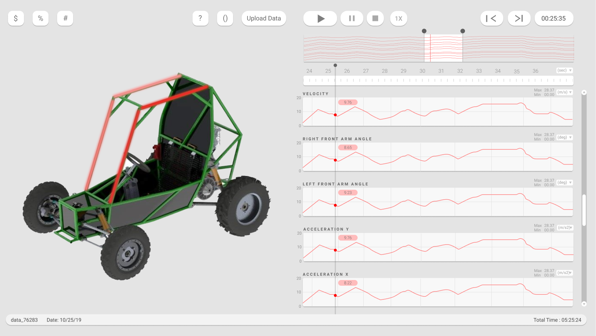

# xStreamDataAnalysisPlatform

# Live Demo. Press Play!
# Currently offline as I move my server stuff over to Caddy.
# [http://adam.teaches.engineering](http://adam.teaches.engineering)

Data Analytics Platform for BCIT Racing Car. (In Development)

This tool works in tandem with an ESP32 module that gathers data from an offroad buggy.
The ESP32 gathers data such as stress in frame members, suspension angles, RPM readings, car tilt, engine heat, and GPS position. The ESP32 then sends this data using websockets periodically (default every 100ms) to the Node server.
The Node server sends this data to all connected clients on the demo site.

Core Features:
 - Realtime data capture and viewing using websockets. (See realtime data from anywhere while car is running)
 - Scrub through data easily and quickly.
 - Suspension links and car in 3D model move based on realtime or imported real world sensor data.
 - Change color of specific frame members based on stress data experienced.
 - Play, pause, stop to navigate through data.
 - Speed settings to replay data.
 - See live location data of car on the track.
 
During a Baja car test or race when the data aquisition module is on, go to the demo website to see realtime data.
 
